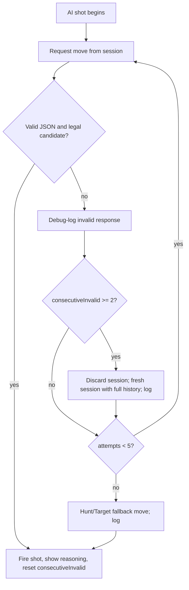
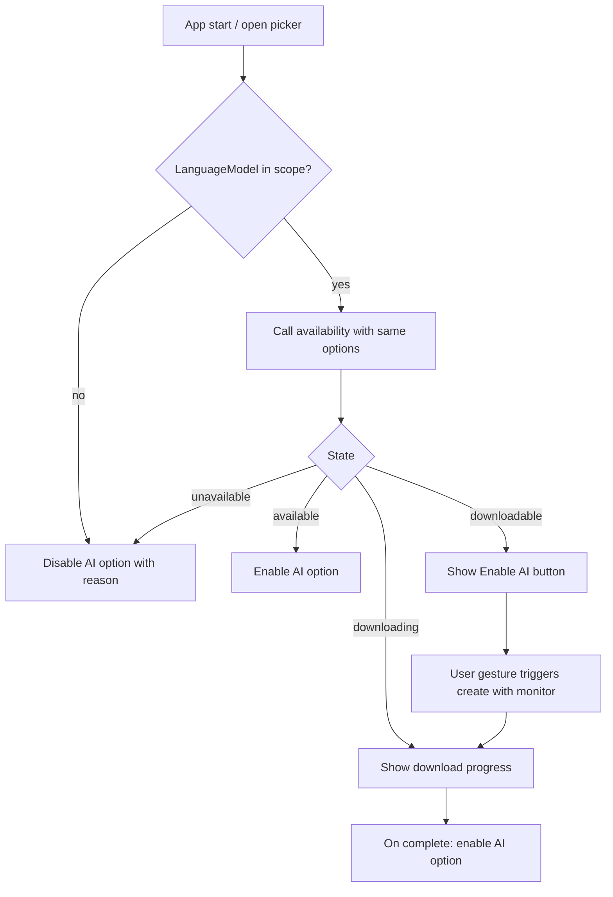

# Nano Battleship - Specification

> Status: Implemented v1.0 (matches shipped code)
> Scope: This document is the authoritative, normative specification for the Nano
> Battleship web game. It describes **what** must be built, not the
> implementation code. Where it uses RFC 2119 keywords (MUST, MUST NOT, SHOULD,
> MAY), they carry their conventional meaning.

---

## 1. Overview & Goals

Nano Battleship is an in-browser, single-player implementation of the classic
Battleship game. The player places a fleet and battles a single computer
opponent of their choosing.

The headline ("killer") feature is an **on-device AI opponent** powered by
Chrome's built-in Prompt API (Gemini Nano). All AI inference runs locally in the
browser; there is no server and no cloud AI.

Goals:

- Deliver a polished, accessible, classic Battleship experience.
- Make the AI-Nano opponent the centerpiece: a genuinely on-device LLM that
  plays fairly under fog-of-war and exposes its reasoning to the player.
- Degrade gracefully: when the Prompt API is unavailable, the AI option is
  hidden/disabled and two conventional bots remain fully playable.

Non-goals are listed in [Section 12](#12-non-goals).

---

## 2. Tech Stack & Constraints

- **Language/build:** Vanilla TypeScript compiled/bundled with **Vite**. No UI
  framework (no React/Vue/Svelte). DOM is manipulated directly.
- **Runtime:** Modern evergreen browsers for the base game. The AI-Nano opponent
  additionally requires the Prompt API (see constraints below).
- **Persistence:** `localStorage` for **settings only** (see
  [Section 11](#11-persistence)). In-progress matches are **not** persisted and
  reset on reload.
- **No backend:** The app MUST be fully static and runnable from a static host.

### 2.1 AI platform constraints (must be documented in-app)

- The Prompt API / Gemini Nano is available only in **official Google Chrome
  desktop builds (version 148+)** on Windows 10/11, macOS 13+, Linux, and
  Chromebook Plus (ChromeOS platform 16389.0.0+).
- It is **not** available on Chrome for Android/iOS, nor on ChromeOS on
  non-Chromebook-Plus devices.
- Distro-packaged Chromium, Brave, Edge, and CEF/embedded builds typically lack
  the on-device model component; `LanguageModel.availability()` will report
  `unavailable`/`downloading` regardless of hardware. The app MUST treat these as
  "AI unavailable" and fall back to conventional bots.
- **Hardware (enforced by Chrome, surfaced via `availability()`):**
  - ~22 GB free disk space on the volume containing the Chrome profile (model
    is removed if free space drops below ~10 GB after download).
  - GPU with **>4 GB VRAM**, **or** CPU path with **≥16 GB RAM** and **≥4 CPU
    cores**.
  - Unmetered network connection for the **initial model download only**; play
    is offline afterward. No prompt data is sent to Google.
- The model is downloaded on first use per origin (multi-GB), gated behind a
  user gesture (`create()` after meaningful interaction).

### 2.2 Enabling the Prompt API when it is behind flags

On **localhost**, in **older Chrome builds**, or when `LanguageModel` is missing
from the global scope, users may need to enable Chrome flags and relaunch:

1. [`chrome://flags/#prompt-api-for-gemini-nano`](chrome://flags/#prompt-api-for-gemini-nano)
   — set to **Enabled** (or **Enabled multilingual**).
2. [`chrome://flags/#optimization-guide-on-device-model`](chrome://flags/#optimization-guide-on-device-model)
   — set to **Enabled**; use **Enabled BypassPerfRequirement** if hardware checks
   fail on a capable machine.

After relaunch, confirm in DevTools: `await LanguageModel.availability()` should
not return `"unavailable"`. Troubleshoot at
[`chrome://on-device-internals`](chrome://on-device-internals) (Model Status tab).

Chrome **148+ stable desktop** on supported hardware generally exposes the Prompt
API without flags. Flags remain the fallback for local development and pre-ship
builds.

### 2.3 Static hosting

The app MUST be fully static. It is deployed to **GitHub Pages** at
`/nano-battleship/` (Vite `base` path in production).

---

## 3. Game Rules (normative)

- **Board:** Two 10x10 grids (columns A-J, rows 1-10), one per side.
- **Fleet:** 5 ships per side with lengths **5, 4, 3, 3, 2** (Carrier,
  Battleship, Cruiser, Submarine, Destroyer).
- **Placement legality:** Ships are axis-aligned (horizontal or vertical). Ships
  MUST NOT overlap and MUST NOT touch each other, including diagonally (every
  ship must be surrounded by at least one empty cell or a board edge on all
  sides). This applies to both the human fleet and every bot's fleet.
- **Turn flow (extra shot on hit):** On a player's turn they fire at one enemy
  cell.
  - A **hit** grants the same player **another shot** immediately. The player
    keeps firing until they **miss**.
  - A **miss** ends the turn and passes control to the opponent.
- **Firing legality:** A cell MUST NOT be fired upon twice. The UI MUST prevent
  re-firing already-targeted cells.
- **Sinking:** When all cells of a ship are hit, it is **sunk**. The defender's
  side MUST be informed which ship was sunk (used by bots and shown to the
  player).
- **Win condition:** A side wins when **all 5 enemy ships are sunk**. The match
  ends immediately.
- **First turn:** Chosen **at random** (50/50) when the match starts.
- **Bot fleet:** The opponent's fleet is **auto-randomized** at match start and
  remains hidden until the match ends.

---

## 4. Opponent Selection

Before a match the player chooses exactly one opponent from a menu:

1. **Hunt/Target bot** (conventional) - always available.
2. **Probability-density bot** (conventional) - always available.
3. **AI-Nano** (on-device LLM) - available **only** when the Prompt API is
   usable on the current browser/device.

Requirements:

- When the Prompt API is unavailable, the AI-Nano entry MUST be visibly
  **disabled** (not removed) with a short, clear explanation of why (e.g.
  "Requires Google Chrome 148+ on desktop") and, where applicable, a link/short
  note about enabling it.
- The opponent picker MUST reflect availability state changes (e.g. after a
  model download completes, the AI option becomes enabled).
- The last chosen opponent SHOULD be remembered across reloads (see
  [Section 11](#11-persistence)), but MUST silently fall back to a conventional
  bot if the remembered choice was AI-Nano and AI is no longer available.

---

## 5. Conventional Bots

Both conventional bots play under the same fog-of-war as the player (they only
know the results of their own shots: miss, hit, sunk). Neither bot may read the
human's ship layout.

### 5.1 Hunt/Target bot

- **Hunt mode:** When there are no unresolved hits, fire at a randomly chosen
  cell. SHOULD use a **parity** mask (checkerboard, stepped by the smallest
  remaining ship length where practical) to reduce wasted shots.
- **Target mode:** After a hit that has not yet sunk a ship, switch to probing
  the **orthogonal neighbors** of known hits. Once two or more in-line hits
  exist, continue firing **along that line** in both directions until the ship is
  sunk.
- On a sink, clear the resolved hits from the target queue and return to hunt
  mode.

### 5.2 Probability-density bot

- Each turn, compute a **per-cell probability heatmap**: for every
  not-yet-sunk ship still in the enemy fleet, enumerate all legal placements
  consistent with the known board state (misses block placement; unhit cells are
  candidates), and increment each covered cell's score.
- Weight/boost cells adjacent to existing unresolved **hits** so the bot
  prioritizes finishing damaged ships.
- Fire at the **highest-scoring legal (un-fired) cell**, breaking ties randomly.

### 5.3 Shared fallback role

The Hunt/Target algorithm (5.1) is also used as the **AI-Nano fallback move
generator** (see [Section 6.6](#66-resilience--fallback)).

---

## 6. AI-Nano Opponent (core specification)

The AI-Nano opponent uses an on-device Gemini Nano session via the Prompt API
to choose each shot. To keep small models reliable, the app uses a **hybrid
tactical loop**: the application computes legal candidate cells from fog-of-war
state (Hunt/Target logic), constrains the model to pick one of them, and still
displays the model's `reasoning` to the player.

### 6.1 Fairness (fog-of-war)

- The model MUST operate under strict fog-of-war. It MUST only ever receive
  information derivable from **its own shots** against the player's board:
  - the grid dimensions and coordinate system (columns A–J, rows 1–10),
  - an ASCII **fog grid** built from shot history (`.`=unknown, `O`=miss,
    `X`=hit, `#`=sunk),
  - for each cell it has fired on: the result (`miss`, `hit`, or `sunk` + which
    ship sank),
  - the list of enemy ship sizes still afloat,
  - the current tactical **mode** (`HUNT` or `TARGET`),
  - a **candidate list** of legal, not-yet-fired cells (see [6.1.1](#611-candidate-generation)),
  - optionally the **last shot result** and retry hints on validation failure.
- The model MUST NOT be given the player's ship positions, nor any cell state it
  has not earned through its own fire.

#### 6.1.1 Candidate generation

Each turn, before prompting the model, the app:

1. Derives Hunt/Target state from the AI's shot history.
2. Computes a **primary** recommended cell via the Hunt/Target bot ([5.1](#51-hunttarget-bot)).
3. Builds a **candidate pool** (deduplicated, capped at 16 cells):
   - always includes the primary cell;
   - in **TARGET** mode (unresolved hits): orthogonal neighbors and in-line
     extensions from known hits;
   - in **HUNT** mode: parity-spaced cells plus a small random sample of
     untouched cells.
4. Passes candidate labels (e.g. `C4`) to the model; already-fired cells are
   listed separately as **FORBIDDEN**.

The model chooses **which candidate** to fire on and explains why; it does not
pick arbitrary off-list coordinates.

### 6.2 Output contract (strict JSON)

- The model MUST respond with **strict JSON only** (no prose outside the JSON).
- **Primary shape** (enforced via `responseConstraint` JSON Schema):

```json
{ "target": "C4", "reasoning": "short explanation of the chosen target" }
```

- `target` MUST be a coordinate label (`A1`–`J10`) copied **exactly** from the
  candidate list. `reasoning` is a short human-readable string.
- The parser MAY also accept legacy `{ "row": 0, "col": 0, "reasoning": "..." }`
  with 0-indexed integers for robustness, but the constrained `target` form is
  normative.
- **Validation:** A response is **valid** only if it parses as JSON, includes
  `reasoning`, resolves to a legal coordinate, the coordinate is in the current
  candidate set, and the cell has **not already been fired upon**. Anything else
  is **invalid**.

### 6.3 Session model

- **Model download:** A separate warmup `LanguageModel.create()` call (with
  `downloadprogress` monitoring) may run once after a user gesture to trigger
  the on-device model download. That warmup session is destroyed immediately;
  it is not used for gameplay.
- **Match session:** The app MUST create **one persistent `LanguageModel`
  session per match**, with:
  - a system prompt (rules, coordinates, output contract, remaining ship sizes,
    Hunt/Target strategy hints),
  - optional `initialPrompts` replaying full shot history when restarting a
    session ([6.6](#66-resilience--fallback)).
- On **each AI shot**, the app sends a **full turn prompt** containing the fog
  grid, forbidden cells, candidate list, recommended cell, tactical mode, and
  the latest shot result (if any). Retry prompts append validation feedback.
- The first shot uses the same turn-prompt shape; there is no separate
  "opening move" prose-only prompt.

### 6.4 Reasoning transcript

- The `reasoning` field from each accepted move MUST be displayed live in a
  side **transcript/log panel**, attributed to the AI, alongside the coordinate
  it fired on.
- The transcript SHOULD also surface notable system events (retry, fresh
  session, fallback) in a user-friendly form (full detail goes to debug logs,
  see [6.7](#67-debug-logging)).

### 6.5 Turn loop with extra-shot rule

Because a hit grants another shot, the AI may take multiple consecutive shots in
one turn. Each individual shot runs through the request/validate/resilience loop
below. After a shot resolves:

- if it was a **hit/sunk** (and the player still has ships), the AI immediately
  takes another shot;
- if it was a **miss**, the AI's turn ends.

### 6.6 Resilience & fallback

The following logic governs a **single AI shot** and MUST emit debug logs at
every branch (see [6.7](#67-debug-logging)):

- Maintain an `attempts` counter (per shot) and a `consecutiveInvalid` counter.
- Request a move from the session; validate per [6.2](#62-output-contract-strict-json).
  - **Valid:** fire the shot, reset `consecutiveInvalid`, render reasoning, done.
  - **Invalid:** increment `attempts` and `consecutiveInvalid`; log the raw
    response and the reason it was rejected; then:
    - If `consecutiveInvalid >= 2`: **discard the session and start a fresh
      one**, re-seeded with the system prompt **and the full board shot history**
      (all of the AI's prior shots and their results). Reset `consecutiveInvalid`
      to 0 and log the restart.
    - If `attempts < MAX_ATTEMPTS_PER_MOVE`: re-prompt (loop).
    - Else (`attempts` reached the cap): **fall back** to the **Hunt/Target**
      algorithm ([5.1](#51-hunttarget-bot)) to choose a legal move for this
      shot, log the fallback, and fire that move. The persistent session is kept
      for subsequent shots (a single bad shot does not end AI play).
- If the session throws `InvalidStateError` (destroyed), recreate the match
  session with full history and retry the same prompt once.

Thresholds (confirmed defaults; treated as named constants in the spec):

- `FRESH_SESSION_AFTER_CONSECUTIVE_INVALID = 2`
- `MAX_ATTEMPTS_PER_MOVE = 5`



### 6.7 Debug logging

- A dedicated debug logger MUST record, at minimum: each prompt sent (or a
  redactable summary), each raw model response, every validation failure with its
  reason, every fresh-session restart (with the reason and history size), and
  every fallback (with the chosen fallback cell).
- Debug logs are **developer-facing only** (browser `console`; no in-app debug
  panel) and are separate from the player-facing transcript
  ([6.4](#64-reasoning-transcript)).
- Logs MUST NOT block gameplay and SHOULD be throttle-safe (ring buffer capped,
  e.g. 200 entries).

---

## 7. Prompt API Availability & Model Download UX

### 7.1 Detection

- On load (and when the player opens the opponent picker), the app MUST detect
  Prompt API support by checking for `LanguageModel` in scope and calling
  `LanguageModel.availability()`.
- The app MUST handle all four states:
  - `available` - ready to use immediately.
  - `downloadable` - supported but the model must be downloaded first.
  - `downloading` - a download is in progress.
  - `unavailable` - not supported on this browser/device.
- `availability()` SHOULD be called with options consistent with later
  `create()`/`prompt()` calls. The implementation uses a minimal probe
  (`LanguageModel.availability({ systemPrompt: '' })`) on load; full
  `systemPrompt`, `initialPrompts`, and per-turn `responseConstraint` are applied
  at session creation and prompt time.

### 7.2 Download flow

- Model download MUST be triggered by a **user gesture** (e.g. selecting AI-Nano
  or pressing an explicit "Enable on-device AI" button).
- During download the app MUST subscribe to the `downloadprogress` events on the
  creation monitor and show a **progress indicator** with percentage so the UI
  never appears frozen.
- On completion, the AI-Nano option becomes enabled/selectable.
- Download/initialization errors MUST be surfaced clearly and MUST leave the
  conventional bots fully usable.

### 7.3 Disabled-state messaging

- When state is `unavailable`, the AI-Nano option MUST be disabled with a concise
  reason (platform/browser requirement) per [Section 4](#4-opponent-selection).



---

## 8. Ship Placement UX

- The player places their fleet on their own 10x10 board before the match.
- **Manual placement:** drag-and-drop each ship onto the grid, with a control to
  **rotate** between horizontal and vertical orientation.
- **Validity feedback:** while dragging/placing, the UI MUST indicate whether the
  current position is legal under [Section 3](#3-game-rules-normative)
  (no overlap, no adjacency, within bounds) and MUST refuse illegal drops.
- **Randomize:** a button that auto-places all remaining/whole fleet legally
  (re-rollable).
- **Clear:** a button that removes all placed ships to start over.
- **Ready/Start gate:** the match cannot begin until all 5 ships are legally
  placed; a Start/Ready control becomes enabled only then.

---

## 9. UI Layout

The screen MUST present:

- **Two boards:** the player's board (ships visible) and the enemy board shown as
  **fog** (only the player's own shot results revealed).
- **Opponent picker** with availability states ([Section 4](#4-opponent-selection)).
- **Transcript/log panel:** for AI-Nano, shows reasoning and system events
  ([Section 6.4](#64-reasoning-transcript)); for conventional bots, shows a
  simple **Move Log** (coordinate + result per shot).
- **Status / turn indicator:** whose turn it is, last result, and end-of-match
  result.
- **Controls:** placement controls (rotate/randomize/clear/start), new-match /
  reset, and a mute toggle.
- **Model/AI status area:** availability and download progress
  ([Section 7](#7-prompt-api-availability--model-download-ux)).

---

## 10. Polish (in scope)

- **Accessibility:** Full keyboard play (place ships, navigate the firing grid,
  fire) and ARIA/screen-reader support (cells announce coordinate and state;
  turn and result changes announced via live regions). Visible focus states.
- **Responsive layout:** Mobile-friendly, reflowing layout for small screens.
  The UI MUST clearly note that the AI-Nano opponent is **desktop Chrome only**;
  conventional bots remain available on mobile.
- **Sound effects:** Fire, hit, miss, sink, win/lose cues with a **mute toggle**
  (state persisted, see [Section 11](#11-persistence)).
- **Animations:** Hit, miss, and sink animations on the boards. Animations MUST
  be skipped when the user agent reports `prefers-reduced-motion: reduce` (read
  at app startup; not a separate in-app toggle).
- **Per-match stats:** Track and display shots fired, hits, accuracy, and turns
  taken (per side), shown during and at end of match.

---

## 11. Persistence

- Persist **settings only** in `localStorage`:
  - last selected opponent type,
  - mute/sound preference.
- Reduced motion follows the system `prefers-reduced-motion` media query at
  startup (not persisted as a user-facing setting).
- In-progress match state MUST NOT be persisted; reloading starts a fresh setup.
- A remembered AI-Nano opponent choice MUST fall back to a conventional bot if
  AI is unavailable on load.

---

## 12. Non-Goals

- No multiplayer or networking (no online play, no pass-and-play).
- No server-side or cloud AI; all AI is on-device via the Prompt API.
- No resume-after-reload of an in-progress match.
- No accounts, profiles, or persistent leaderboards.
- No selectable difficulty beyond the three opponent types in
  [Section 4](#4-opponent-selection).

---

## 13. Data Model & State (described, not coded)

Conceptual entities the implementation will need (described, not prescribing
concrete code):

- **Coordinate:** `{ row: 0..9, col: 0..9 }`; helpers to/from human labels
  (e.g. `C4`).
- **Orientation:** horizontal | vertical.
- **Ship:** id, name, length, orientation, anchor coordinate, set of occupied
  cells, and hit cells; derived `isSunk`.
- **Fleet:** ordered collection of the 5 ships; helpers for legal placement
  (overlap + adjacency checks) and remaining (afloat) ship sizes.
- **Board:** 10x10 cell grid per side; per cell: occupied-by-ship (own board
  only) and shot state (untouched | miss | hit).
- **ShotResult:** `miss` | `hit` | `sunk(shipSize/ship)`.
- **GamePhase:** `setup` | `playing` | `finished`, plus whose turn it is.
- **OpponentType:** `huntTarget` | `probability` | `aiNano`.
- **AI session state:** handle to the persistent `LanguageModel` session, plus
  per-shot `attempts` and `consecutiveInvalid` counters, tactical candidate
  context, and the AI's own shot history (for fresh-session re-seeding).
- **TacticalContext:** mode (`hunt`|`target`), candidate coordinates, primary
  recommendation, forbidden labels, fog grid string.
- **Availability state:** `available` | `downloadable` | `downloading` |
  `unavailable`, plus download progress.
- **Stats:** per side - shots, hits, accuracy, turns.
- **Settings:** last opponent, mute, UI preferences (persisted).

---

## 14. Open Risks

- **Nano output instability:** Small on-device models can emit malformed or
  illegal moves. Mitigated by the strict JSON contract, validation, retry,
  fresh-session restart, and Hunt/Target fallback ([Section 6](#6-ai-nano-opponent-core-specification)).
- **First-run model download:** Potentially multi-GB and slow; mitigated by clear
  progress UX and keeping conventional bots fully playable meanwhile.
- **Platform fragmentation:** Only official Chrome desktop supports the API;
  conventional bots ensure the game is always playable.
- **Latency:** On-device inference adds per-move latency; the UI MUST show a
  thinking indicator and remain responsive.
