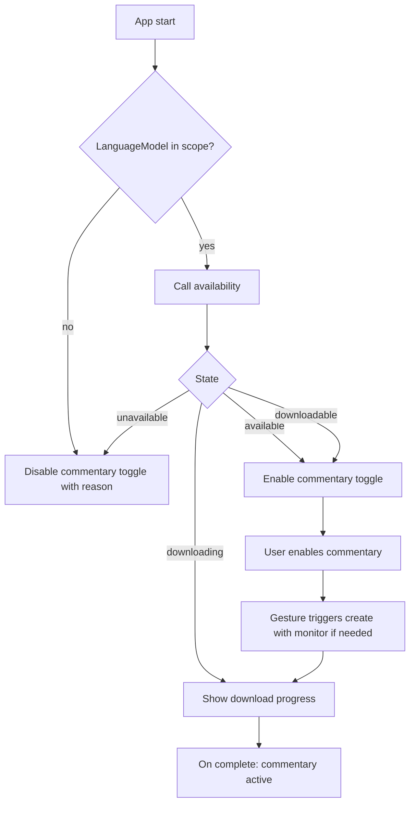

# Nano Battleship - Specification

> Status: Implemented v1.1 (matches shipped code)
> Scope: This document is the authoritative, normative specification for the Nano
> Battleship web game. It describes **what** must be built, not the
> implementation code. Where it uses RFC 2119 keywords (MUST, MUST NOT, SHOULD,
> MAY), they carry their conventional meaning.

---

## 1. Overview & Goals

Nano Battleship is an in-browser, single-player implementation of the classic
Battleship game. The player places a fleet and battles a single **algorithmic**
opponent of their choosing, optionally accompanied by an on-device AI
**commentator**.

All AI inference runs locally in the browser via Chrome's built-in Prompt API
(Gemini Nano); there is no server and no cloud AI.

Goals:

- Deliver a polished, accessible, classic Battleship experience.
- Provide two strong, fully-offline algorithmic bots as the actual opponents.
- Offer an **optional, kid-friendly on-device AI commentator** that narrates the
  match with light humor, layered on top of whichever bot is selected.
- Degrade gracefully: when the Prompt API is unavailable, the commentary toggle is
  disabled and both bots remain fully playable.

### 1.1 Design rationale — why AI does NOT pick moves

Choosing Battleship shots well is a **spatial-combinatorial** task: track a 10×10
grid across turns, enumerate legal remaining-ship placements, and count which cell
maximizes hit probability. LLMs reason over text, not coordinate grids, and are
unreliable at exactly this; small on-device models most of all. Meanwhile a tiny
deterministic algorithm (the Probability Bot, [Section 5.2](#52-probability-density-bot))
solves it near-optimally and instantly.

Therefore the move decision MUST be made by an algorithmic bot. The on-device
model MUST be used **only** for player-facing commentary
([Section 6](#6-ai-commentary-captain-quack)) and MUST NOT influence move
selection, board state, or game outcome.

Non-goals are listed in [Section 12](#12-non-goals).

---

## 2. Tech Stack & Constraints

- **Language/build:** Vanilla TypeScript compiled/bundled with **Vite**. No UI
  framework (no React/Vue/Svelte). DOM is manipulated directly.
- **Runtime:** Modern evergreen browsers for the full game. The AI commentary
  feature additionally requires the Prompt API (see constraints below).
- **Persistence:** `localStorage` for **settings only** (see
  [Section 11](#11-persistence)). In-progress matches are **not** persisted and
  reset on reload.
- **No backend:** The app MUST be fully static and runnable from a static host.

### 2.1 AI platform constraints (must be documented in-app)

- The Prompt API / Gemini Nano is available only in **official Google Chrome
  desktop builds (version 148+)** on Windows 10/11, macOS 13+, Linux, and
  Chromebook Plus (ChromeOS platform 16389.0.0+).
- It is **not** available on Chrome for Android/iOS, nor on ChromeOS on
  non-Chromebook-Plus devices.
- Distro-packaged Chromium, Brave, Edge, and CEF/embedded builds typically lack
  the on-device model component; `LanguageModel.availability()` will report
  `unavailable`/`downloading` regardless of hardware. The app MUST treat these as
  "AI unavailable" and disable the commentary toggle.
- **Hardware (enforced by Chrome, surfaced via `availability()`):**
  - ~22 GB free disk space on the volume containing the Chrome profile (model
    is removed if free space drops below ~10 GB after download).
  - GPU with **>4 GB VRAM**, **or** CPU path with **≥16 GB RAM** and **≥4 CPU
    cores**.
  - Unmetered network connection for the **initial model download only**; play
    and commentary are offline afterward. No prompt data is sent to Google.
- The model is downloaded on first use per origin (multi-GB), gated behind a
  user gesture (enabling commentary).

### 2.2 Enabling the Prompt API when it is behind flags

On **localhost**, in **older Chrome builds**, or when `LanguageModel` is missing
from the global scope, users may need to enable Chrome flags and relaunch:

1. [`chrome://flags/#prompt-api-for-gemini-nano`](chrome://flags/#prompt-api-for-gemini-nano)
   — set to **Enabled** (or **Enabled multilingual**).
2. [`chrome://flags/#optimization-guide-on-device-model`](chrome://flags/#optimization-guide-on-device-model)
   — set to **Enabled**; use **Enabled BypassPerfRequirement** if hardware checks
   fail on a capable machine.

After relaunch, confirm in DevTools: `await LanguageModel.availability()` should
not return `"unavailable"`. Troubleshoot at
[`chrome://on-device-internals`](chrome://on-device-internals) (Model Status tab).

Chrome **148+ stable desktop** on supported hardware generally exposes the Prompt
API without flags. Flags remain the fallback for local development and pre-ship
builds.

### 2.3 Static hosting

The app MUST be fully static. It is deployed to **GitHub Pages** at
`/nano-battleship/` (Vite `base` path in production).

---

## 3. Game Rules (normative)

- **Board:** Two 10x10 grids (columns A-J, rows 1-10), one per side.
- **Fleet:** 5 ships per side with lengths **5, 4, 3, 3, 2** (Carrier,
  Battleship, Cruiser, Submarine, Destroyer).
- **Placement legality:** Ships are axis-aligned (horizontal or vertical). Ships
  MUST NOT overlap and MUST NOT touch each other, including diagonally (every
  ship must be surrounded by at least one empty cell or a board edge on all
  sides). This applies to both the human fleet and the bot's fleet.
- **Turn flow (extra shot on hit):** On a player's turn they fire at one enemy
  cell.
  - A **hit** grants the same player **another shot** immediately. The player
    keeps firing until they **miss**.
  - A **miss** ends the turn and passes control to the opponent.
- **Firing legality:** A cell MUST NOT be fired upon twice. The UI MUST prevent
  re-firing already-targeted cells.
- **Sinking:** When all cells of a ship are hit, it is **sunk**. The defender's
  side MUST be informed which ship was sunk (used by bots and shown to the
  player).
- **Win condition:** A side wins when **all 5 enemy ships are sunk**. The match
  ends immediately.
- **First turn:** Chosen **at random** (50/50) when the match starts.
- **Bot fleet:** The opponent's fleet is **auto-randomized** at match start and
  remains hidden until the match ends.

---

## 4. Opponent Selection

Before a match the player chooses exactly one opponent from a menu. Both options
are **algorithmic** and **always available** (no network, no Prompt API):

1. **Hunt/Target bot** ([5.1](#51-hunttarget-bot)).
2. **Probability-density bot** ([5.2](#52-probability-density-bot)).

The optional AI commentator ([Section 6](#6-ai-commentary-captain-quack)) is a
**separate toggle**, not an opponent. It is orthogonal to the opponent choice and
can be enabled with either bot.

Requirements:

- The last chosen opponent SHOULD be remembered across reloads (see
  [Section 11](#11-persistence)).
- A persisted opponent value that is no longer valid (e.g. the retired `aiNano`
  player from a prior version) MUST be migrated to a valid bot on load.

---

## 5. Algorithmic Bots

Both bots play under the same fog-of-war as the player (they only know the results
of their own shots: miss, hit, sunk). Neither bot may read the human's ship
layout. The selected bot is the **sole** decider of every opponent shot.

### 5.1 Hunt/Target bot

- **Hunt mode:** When there are no unresolved hits, fire at a randomly chosen
  cell. SHOULD use a **parity** mask (checkerboard, stepped by the smallest
  remaining ship length where practical) to reduce wasted shots.
- **Target mode:** After a hit that has not yet sunk a ship, switch to probing
  the **orthogonal neighbors** of known hits. Once two or more in-line hits
  exist, continue firing **along that line** in both directions until the ship is
  sunk.
- On a sink, clear the resolved hits from the target queue and return to hunt
  mode.

### 5.2 Probability-density bot

- Each turn, compute a **per-cell probability heatmap**: for every not-yet-sunk
  ship still in the enemy fleet, enumerate all legal placements consistent with
  the known board state and increment each covered cell's score.
- **Blocked cells:** a placement MUST NOT overlap a known **miss** or a cell
  occupied by an **already-sunk** ship.
- **Sunk-ship reconstruction:** because ships never touch (not even diagonally),
  a sunk ship's hull is exactly the contiguous run of damaged cells through the
  sinking shot. The bot MUST reconstruct that hull so that (a) those cells are
  treated as blocked, and (b) the sunk ship's earlier hits are **not** treated as
  still-wounded ships. This prevents wasting shots around an already-destroyed
  ship.
- **Unresolved hits:** hits not attributed to any sunk ship are the wounded ships
  to finish. The bot MUST boost cells orthogonally adjacent to unresolved hits so
  it prioritizes finishing damaged ships.
- Fire at the **highest-scoring legal (un-fired) cell**, breaking ties randomly.

---

## 6. AI Commentary ("Captain Quack")

An **optional** on-device Gemini Nano session provides short, humorous,
kid-friendly narration of the match. It is purely cosmetic: it MUST NOT affect
move selection, board state, turn flow, or outcome
([Section 1.1](#11-design-rationale--why-ai-does-not-pick-moves)).

### 6.1 Activation

- Commentary is controlled by a single **toggle** in the setup UI, persisted in
  settings ([Section 11](#11-persistence)).
- The toggle MUST be **disabled** when the Prompt API is unavailable, with a
  concise reason surfaced to the user (e.g. via tooltip).
- Enabling commentary for the first time MAY trigger the model download
  ([Section 7](#7-prompt-api-availability--model-download-ux)); this MUST be
  gated behind the user's toggle gesture.
- Commentary works with **either** bot and in no way changes how the bot plays.

### 6.2 Persona & content safety (normative)

- The model is given a fixed persona: a silly, friendly cartoon character
  ("Captain Quack") narrating for young children.
- The system prompt MUST constrain output to:
  - **one short sentence** (≈16 words or fewer),
  - playful, gentle humor appropriate for ~7-year-olds,
  - **no** profanity, insults, name-calling, scary content, violence, blood, or
    real-world weapons; cartoony imagery only (splashes, bubbles, fish, ducks),
  - never demeaning the player.
- **Defense in depth:** the app MUST NOT trust the model's output blindly. Every
  generated line MUST pass an independent **sanitizer** before display, which:
  - keeps only the first line and strips wrapping quotes/markers,
  - caps length (characters and word count),
  - rejects any line matching a **profanity/unsafe word list** using
    word-boundary matching (so safe words containing a banned substring — e.g.
    "class", "assist" — are not falsely rejected).
- If the sanitizer rejects a line (or the model errors or is slow), the app MUST
  substitute a **safe canned quip** appropriate to the event so the player still
  sees friendly output. The game never shows unscreened model text.

### 6.3 Triggering & non-blocking behavior

- A quip MAY be generated after each resolved shot (the player's and the
  opponent's), keyed off the result (`miss` / `hit` / `sunk`).
- Commentary MUST be **fire-and-forget**: generating a quip MUST NOT block, delay,
  or gate gameplay. Moves resolve at full speed regardless of model latency.
- The app SHOULD avoid overlapping requests on the single commentary session
  (e.g. skip a new quip while one is still generating).
- Quips appear in the side panel ([Section 9](#9-ui-layout)) attributed to the
  commentator.

### 6.4 Session model

- **Model download:** a warmup `LanguageModel.create()` call (with
  `downloadprogress` monitoring) may run once after the user enables commentary to
  trigger the on-device model download. That warmup session is destroyed
  immediately.
- **Commentary session:** the app creates a dedicated `LanguageModel` session for
  commentary, seeded with the persona system prompt. It is created when commentary
  becomes active (toggle on / match start) and destroyed on reset/new match or
  when commentary is turned off. It carries **no** board state and is independent
  of the bot.
- Fairness note: because commentary is cosmetic and reacts to already-resolved,
  player-visible results, it is **not** bound by the move-time fog-of-war rules.

### 6.5 Debug logging

- A developer-facing debug logger SHOULD record raw quips and filter decisions
  (e.g. which banned word triggered a rejection) to the browser `console` only.
- Debug logs MUST NOT block gameplay and MUST be separate from the player-facing
  commentary panel.

---

## 7. Prompt API Availability & Model Download UX

### 7.1 Detection

- On load, the app MUST detect Prompt API support by checking for `LanguageModel`
  in scope and calling `LanguageModel.availability()`.
- The app MUST handle all four states:
  - `available` - ready to use immediately.
  - `downloadable` - supported but the model must be downloaded first.
  - `downloading` - a download is in progress.
  - `unavailable` - not supported on this browser/device.
- `availability()` SHOULD be called with options consistent with later
  `create()` calls. The implementation uses a minimal probe
  (`LanguageModel.availability({ systemPrompt: '' })`) on load.

### 7.2 Download flow

- Model download MUST be triggered by a **user gesture** — enabling the **Funny
  AI commentary** toggle.
- During download the app MUST subscribe to the `downloadprogress` events on the
  creation monitor and show a **progress indicator** with percentage so the UI
  never appears frozen.
- On completion, commentary becomes active.
- Download/initialization errors MUST be surfaced clearly, MUST revert the toggle
  to off, and MUST leave the bots fully playable.

### 7.3 Disabled-state messaging

- When state is `unavailable`, the commentary toggle MUST be disabled with a
  concise reason (platform/browser requirement).



---

## 8. Ship Placement UX

- The player places their fleet on their own 10x10 board before the match.
- **Manual placement:** drag-and-drop each ship onto the grid, with a control to
  **rotate** between horizontal and vertical orientation.
- **Validity feedback:** while dragging/placing, the UI MUST indicate whether the
  current position is legal under [Section 3](#3-game-rules-normative)
  (no overlap, no adjacency, within bounds) and MUST refuse illegal drops.
- **Randomize:** a button that auto-places all remaining/whole fleet legally
  (re-rollable).
- **Clear:** a button that removes all placed ships to start over.
- **Ready/Start gate:** the match cannot begin until all 5 ships are legally
  placed; a Start/Ready control becomes enabled only then.

---

## 9. UI Layout

The screen MUST present:

- **Two boards:** the player's board (ships visible) and the enemy board shown as
  **fog** (only the player's own shot results revealed).
- **Opponent picker** with the two bots ([Section 4](#4-opponent-selection)).
- **Funny AI commentary toggle** ([Section 6](#6-ai-commentary-captain-quack)),
  disabled with a reason when the Prompt API is unavailable.
- **Side panel:** a **Move Log** of shots (coordinate + result); when commentary
  is enabled it additionally shows the commentator's quips.
- **Status / turn indicator:** whose turn it is, last result, and end-of-match
  result.
- **Controls:** placement controls (rotate/randomize/clear/start), new-match /
  reset, and a mute toggle.
- **Model/AI status area:** availability and download progress
  ([Section 7](#7-prompt-api-availability--model-download-ux)).

---

## 10. Polish (in scope)

- **Accessibility:** Full keyboard play (place ships, navigate the firing grid,
  fire) and ARIA/screen-reader support (cells announce coordinate and state;
  turn and result changes announced via live regions). Visible focus states.
- **Responsive layout:** Mobile-friendly, reflowing layout for small screens.
  The UI MUST clearly note that AI commentary is **desktop Chrome only**; the bots
  remain available on mobile.
- **Sound effects:** Fire, hit, miss, sink, win/lose cues with a **mute toggle**
  (state persisted, see [Section 11](#11-persistence)).
- **Animations:** Hit, miss, and sink animations on the boards. Animations MUST
  be skipped when the user agent reports `prefers-reduced-motion: reduce` (read
  at app startup; not a separate in-app toggle).
- **Per-match stats:** Track and display shots fired, hits, accuracy, and turns
  taken (per side), shown during and at end of match.

---

## 11. Persistence

- Persist **settings only** in `localStorage`:
  - last selected opponent type,
  - mute/sound preference,
  - AI commentary on/off preference.
- A persisted opponent value that is not a currently-valid bot MUST be migrated to
  the default bot on load.
- Reduced motion follows the system `prefers-reduced-motion` media query at
  startup (not persisted as a user-facing setting).
- In-progress match state MUST NOT be persisted; reloading starts a fresh setup.

---

## 12. Non-Goals

- No multiplayer or networking (no online play, no pass-and-play).
- **No AI-driven move selection.** The on-device model is used only for cosmetic
  commentary ([Section 1.1](#11-design-rationale--why-ai-does-not-pick-moves)).
- No server-side or cloud AI; all AI is on-device via the Prompt API.
- No resume-after-reload of an in-progress match.
- No accounts, profiles, or persistent leaderboards.
- No selectable difficulty beyond the two opponent bots.

---

## 13. Data Model & State (described, not coded)

Conceptual entities the implementation will need (described, not prescribing
concrete code):

- **Coordinate:** `{ row: 0..9, col: 0..9 }`; helpers to/from human labels
  (e.g. `C4`).
- **Orientation:** horizontal | vertical.
- **Ship:** id, name, length, orientation, anchor coordinate, set of occupied
  cells, and hit cells; derived `isSunk`.
- **Fleet:** ordered collection of the 5 ships; helpers for legal placement
  (overlap + adjacency checks) and remaining (afloat) ship sizes.
- **Board:** 10x10 cell grid per side; per cell: occupied-by-ship (own board
  only) and shot state (untouched | miss | hit).
- **ShotResult:** `miss` | `hit` | `sunk(shipSize/ship)`.
- **GamePhase:** `setup` | `playing` | `finished`, plus whose turn it is.
- **OpponentType:** `huntTarget` | `probability`.
- **Commentary state:** handle to the optional `LanguageModel` commentary session,
  a busy flag (to avoid overlapping requests), and the safe canned-quip pools.
- **TranscriptEntry:** kind (`bot-move` | `ai-banter` | `system`), text, id,
  timestamp.
- **Availability state:** `available` | `downloadable` | `downloading` |
  `unavailable`, plus download progress.
- **Stats:** per side - shots, hits, accuracy, turns.
- **Settings:** last opponent, mute, commentary on/off (persisted).

---

## 14. Open Risks

- **First-run model download:** Potentially multi-GB and slow; mitigated by clear
  progress UX, keeping the bots fully playable meanwhile, and commentary being
  optional.
- **Platform fragmentation:** Only official Chrome desktop supports the Prompt
  API; the bots ensure the game is always fully playable without it.
- **Commentary safety:** Small on-device models can emit inappropriate text.
  Mitigated by a constrained persona prompt **and** an independent sanitizer /
  profanity filter with safe canned fallbacks ([Section 6.2](#62-persona--content-safety-normative)).
- **Commentary latency:** On-device inference is slow; mitigated by fire-and-forget
  generation that never blocks gameplay.
```
